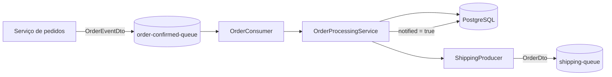

# Order Worker MS

Microsserviço orientado a eventos responsável por processar pedidos confirmados e encaminhá-los para o fluxo de expedição.

A aplicação consome eventos de uma fila Amazon SQS, consulta o pedido no PostgreSQL, publica seus dados em uma segunda fila e registra no banco que a notificação foi realizada.

## Fluxo da aplicação



1. `OrderConsumer` recebe uma mensagem da fila `order-confirmed-queue`.
2. O JSON é convertido em um `OrderEventDto`.
3. `OrderProcessingService` procura o pedido pelo número informado.
4. Quando o pedido existe, `ShippingProducer` publica seus dados em `shipping-queue`.
5. O campo `notified` do pedido é atualizado para `true`.
6. Caso o pedido não exista ou a mensagem seja inválida, o processamento lança uma exceção e nenhuma mensagem é enviada à fila de expedição.

## Tecnologias

- Java 21
- Spring Boot 4.1.0
- Spring Data JPA
- Spring Cloud AWS 4.1.0
- Amazon SQS
- PostgreSQL
- Maven Wrapper 3.9.16
- JUnit 5
- Testcontainers
- LocalStack

## Estrutura do projeto

```text
src
├── main
│   ├── java/tech/buildrun/orderworkems
│   │   ├── consumer       # Consumo de eventos do SQS
│   │   ├── dto            # Contratos das mensagens
│   │   ├── entity         # Entidades JPA
│   │   ├── producer       # Publicação na fila de expedição
│   │   ├── repository     # Acesso ao PostgreSQL
│   │   └── service        # Regras de processamento
│   └── resources          # Configurações da aplicação
└── test
    └── java/tech/buildrun/orderworkems
        ├── consumer       # Testes de integração do consumidor
        └── *Config.java   # PostgreSQL e LocalStack via Testcontainers
```

## Pré-requisitos

Para executar os testes ou o ambiente local de desenvolvimento:

- JDK 21;
- Docker em execução;
- portas `4566` e uma porta dinâmica para o PostgreSQL disponíveis;
- Git, caso o projeto ainda precise ser clonado.

O repositório inclui o Maven Wrapper. Se o wrapper não iniciar no Windows, use uma instalação local do Maven 3.9 ou superior e substitua `.\mvnw.cmd` por `mvn` nos comandos abaixo.

## Formato das mensagens

### Evento recebido

Fila: `order-confirmed-queue`

```json
{
  "orderNumber": "1234"
}
```

### Evento publicado

Fila: `shipping-queue`

```json
{
  "orderNumber": "1234",
  "customerEmail": "cliente@example.com"
}
```

O pedido precisa existir previamente na tabela `orders`. O serviço não possui endpoint HTTP para cadastrá-lo.

## Executando os testes

Com o Docker iniciado, execute na raiz do projeto:

```bash
# Linux e macOS
./mvnw test
```

```powershell
# Windows PowerShell
.\mvnw.cmd test
```

Esse comando inicia um PostgreSQL via Testcontainers e valida o carregamento do contexto Spring.

Para executar explicitamente os testes do fluxo assíncrono, use:

```bash
# Linux e macOS
./mvnw -Dtest=OrderConsumerIT test
```

```powershell
# Windows PowerShell
.\mvnw.cmd "-Dtest=OrderConsumerIT" test
```

Os testes de integração iniciam automaticamente:

- um container PostgreSQL;
- um container LocalStack com o SQS;
- as filas `order-confirmed-queue` e `shipping-queue`.

`OrderConsumerIT` valida o fluxo assíncrono completo: consumo da mensagem, publicação para expedição, atualização do banco e tratamento de pedido inexistente. Como o nome da classe termina em `IT`, ela não é selecionada pelo comando `test` padrão do Maven Surefire e precisa ser informada explicitamente conforme mostrado acima.

> Na primeira execução, o Docker pode precisar baixar as imagens `postgres:latest` e `localstack/localstack:4.9.2`.

## Ambiente local de desenvolvimento

A classe `TestOrderworkemsApplication` prepara um ambiente de desenvolvimento com PostgreSQL e LocalStack em containers. Execute-a pela IDE com o Docker ativo. Ela:

1. inicia o LocalStack na porta `4566`;
2. cria as duas filas SQS;
3. injeta as propriedades locais da AWS;
4. inicia o PostgreSQL por meio do suporte a service connections do Spring Boot;
5. sobe a aplicação.

Esse modo é destinado ao desenvolvimento. Ao encerrar o processo, os containers e seus dados temporários são descartados.

## Executando com infraestrutura externa

Para iniciar `OrderworkemsApplication` diretamente, configure uma instância PostgreSQL, credenciais/região da AWS e as duas filas SQS antes de executar a aplicação.

As propriedades podem ser fornecidas pelo `application.properties`, por argumentos ou pelas variáveis de ambiente equivalentes do Spring Boot:

| Variável | Descrição |
| --- | --- |
| `SPRING_DATASOURCE_URL` | URL JDBC do PostgreSQL |
| `SPRING_DATASOURCE_USERNAME` | Usuário do banco |
| `SPRING_DATASOURCE_PASSWORD` | Senha do banco |
| `SPRING_CLOUD_AWS_REGION_STATIC` | Região das filas SQS |
| `AWS_ACCESS_KEY_ID` | Chave de acesso à AWS |
| `AWS_SECRET_ACCESS_KEY` | Chave secreta da AWS |

Em seguida:

```bash
# Linux e macOS
./mvnw spring-boot:run
```

```powershell
# Windows PowerShell
.\mvnw.cmd spring-boot:run
```

Para usar um endpoint compatível com SQS, como o LocalStack, informe também `SPRING_CLOUD_AWS_ENDPOINT`.

> O projeto usa `spring.jpa.hibernate.ddl-auto=create`. Assim, o esquema é recriado a cada inicialização e os dados existentes podem ser perdidos. Altere essa estratégia antes de utilizar a aplicação em produção.

## Modelo de dados

A tabela `orders` é criada a partir da entidade `Order`:

| Campo | Características |
| --- | --- |
| `id` | Identificador numérico gerado pelo banco |
| `orderNumber` | Número único e obrigatório do pedido |
| `customerEmail` | E-mail obrigatório do cliente |
| `notified` | Indica se o pedido foi enviado ao fluxo de expedição |

## Estado atual e próximos passos

O projeto implementa e testa o caminho principal do processamento assíncrono. Evoluções naturais incluem:

- definir uma política explícita de retentativas e dead-letter queue;
- adicionar migrações de banco com Flyway ou Liquibase;
- substituir `ddl-auto=create` por uma configuração segura para produção;
- adicionar observabilidade, métricas e rastreamento distribuído;
- externalizar e validar toda a configuração de infraestrutura;
- fixar uma versão específica da imagem PostgreSQL usada nos testes.

## Licença

Este repositório ainda não possui um arquivo de licença. Antes de reutilizar ou distribuir o código, defina os termos aplicáveis ao projeto.
